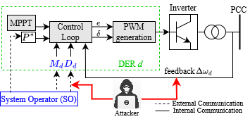

# On the Stability of Power Transmission Systems Under Persistent Inverter Attacks: A Bi-Linear Matrix Approach 

<p align="center" width="100%">
    
</p>
 
## Installation
You first need to set up a python virtual environment. To create a virtual environment, follow this procedure: 

```
# Create virtual environment
pip install virtualenv
python3 -m venv BMIenv
# OR
python -m venv BMIenv
# Activate the environment from directory with code
BMIenv\Scripts\activate
# Install requirements
pip install -r requirements.txt
``` 

## Python files

In ``constant.py``, you can set up the simulation settings. 

For running a simulation, run ``Simulator.py`` in the main folder. It will create two subfolders: Figures and LTIs. In LTIs, you'll find .txt files with matrices for the LTI systems (stable and unstable modes, stable mode is mode 1). In Figures, you'll find a pdf file with simulation plots, saved under the name filename specified in constant.py. 

For getting the $$\\tau_a^{\\mathrm{bound}}$$ bound, run ``LMI_solver.py``.  